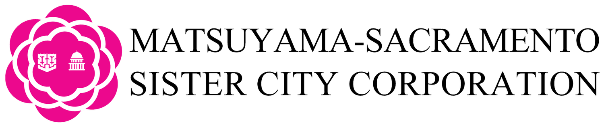

# MSSCC Website

A bilingual (English/Japanese) website for the [Matsuyama-Sacramento Sister City Corporation](https://msscc1.org), replacing their existing Squarespace site. Built by **SCRUM Lords** as a CSUS Computer Science Senior Project (Spring 2026 to Fall 2026).

---

## Project Status

> **In active development.** Sprint 4 complete. Public site and admin portal are partially implemented. Expected delivery: December 2026.

---

## Overview

The project delivers two surfaces:

- **Public site:** informational pages (Home, Events, About, Partners, Donations, Membership, Volunteer), bilingual EN/JP toggle, and Stripe-powered payment processing
- **Admin portal:** event management, member records, donation history, content editing with automatic DeepL translation, and role-based account permissions

---

## Prerequisites

- Python 3.12
- Node.js 22 LTS
- PostgreSQL 16
- Docker (for local dev stack)

## Documentation

Full setup and onboarding guides live in the [`docs/`](./docs) directory:

- [Local Development and Testing Setup](./docs/MSSCC_Dev_Setup_Guide.md)
- [Database Schema (ERD)](./docs/erd.mmd)
- Deployment Guide (To be added next semester)

---

## Tech Stack

| Layer | Technology |
|---|---|
| Frontend | Next.js 14, TypeScript, Tailwind CSS |
| Backend | Django 5.1, Django REST Framework, SimpleJWT |
| Database | PostgreSQL |
| Storage | Cloudflare R2 (prod) / MinIO (dev) |
| Payments | Stripe |
| Email | Resend |
| Translation | DeepL API |
| Frontend hosting | Netlify |
| Backend hosting | Railway |

---

## Repository Structure

```
msscc/
├── frontend/          # Next.js 14 app
│   ├── app/           # App router pages
│   ├── components/    # UI, layout, auth, admin, events, partners
│   ├── context/       # AuthContext
│   ├── services/      # API service layer
│   ├── types/         # TypeScript types
│   └── config/        # Shared config
└── backend/           # Django project
    ├── accounts/      # Auth app (JWT)
    └── ...
```

---

## Why

MSSCC was paying ~\$40/month for Squarespace, a general-purpose site builder with no bilingual support, no admin portal, and no payment integration suited to a non-profit. The replacement stack is expected to run **\~\$6–13/month** in fixed costs (Railway for backend/DB, Cloudflare R2 for storage), with Stripe fees incurred only on actual transactions and no monthly platform fee.

Beyond cost, the stack was chosen to match the project's specific requirements:

- **Next.js + Django:** clean separation between a fast, statically-renderable public site and a structured REST API backend, with JWT auth as the handoff point
- **PostgreSQL:** stores both English and Japanese content side-by-side, enabling the translation workflow without a separate i18n service at runtime
- **Cloudflare R2:** S3-compatible object storage with no egress fees, keeping image hosting costs near zero regardless of traffic
- **DeepL API:** used only when admins publish content edits; translations are cached in the database, so the free tier's 500k character/month limit is more than sufficient
- **Stripe:** explicit non-profit support with a discounted processing rate (~2.2% + $0.30) available to MSSCC upon verification
- **Netlify + Railway:** both offer simple Git-based deploys appropriate for a student team handing off to a non-technical organization

---

## Timeline

The project timeline runs through December 2026 and is organized around nine sprint-based milestones. The plan begins with requirements and foundational setup, then moves into public site development, admin tooling, backend integration, and final MVP delivery.

### Sprint 1: Requirements Review and Planning

Review the existing MSSCC site, confirm stakeholder needs, define the initial product scope, and organize the project backlog. This phase establishes the core requirements for replacing and extending the current Squarespace-based workflow.

### Sprint 2: Project Scaffolding and Public Site Foundation

Set up the application structure, routing, shared layouts, and initial public-facing pages. This phase creates the foundation for the new site experience and establishes the frontend architecture used throughout later sprints.

### Sprint 3: Frontend and Admin Interface Development

Build out the initial admin-facing interface, public styling system, reusable tables, permission-aware UI patterns, and early media assets. This phase focuses on creating the visual and interaction foundation for both the public website and administrative tools.

### Sprint 4: Backend, Authentication, and CMS Integration

Set up the backend and database, implement authentication, begin page-editing functionality, support media retrieval, and connect public-facing pages to backend-managed content. This phase transitions the project from static frontend pages to a data-driven application.

### Sprint 5: Backend Completion and Page Editing

Finish core backend work and continue improving the page-editing workflow. The goal is to make site content manageable through the admin system rather than requiring direct code changes for routine updates.

### Sprint 6: Site Content Management Flows

Complete management flows for board members, partners, events, and media. This phase expands the admin portal so major public site sections can be created, edited, and maintained through structured backend data.

### Sprint 7: Memberships and Donations Integration

Extend admin and backend integration to the remaining major site sections, including memberships and donations. This phase focuses on connecting user-facing forms, administrative records, and payment-related workflows into the broader system.

### Sprint 8: Remaining MVP Features

Complete any remaining MVP functionality needed for the replacement site and admin portal. This includes closing feature gaps, improving integration between frontend and backend systems, and preparing the project for final stabilization.

### Sprint 9: Bug Fixes, Polish, and Final MVP Delivery

Resolve bugs, polish the user experience, complete final testing, and deliver the MVP. This phase prepares the project for stakeholder review, handoff, and eventual production readiness.

---

## Team

**SCRUM Lords** | CSUS Computer Science, Senior Project Spring-Fall 2026

Gina Kim · Ulisses Arredondo · Lucas Bilyk · Keav'n Lor · Sang Nguyen · David Nam · Cole Tanner

**Product Owner:** Bryan Fisher, President, Matsuyama-Sacramento Sister City Corporation  
**CTO:** Robert Martinez

---

## License

Source code and documentation are delivered to MSSCC upon project completion per the terms of the CSUS Senior Project agreement. The CSUS Computer Science Department reserves the right to use project materials as examples of student work.
